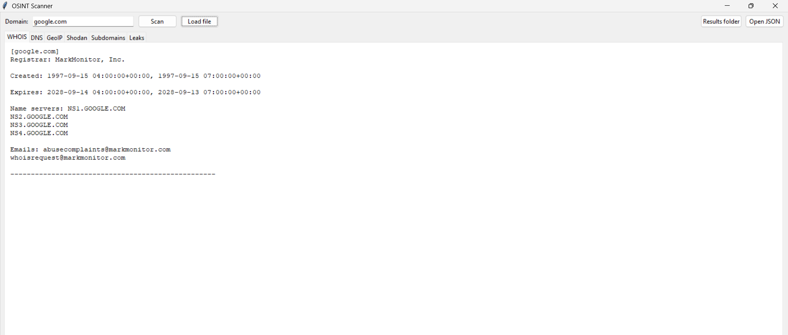
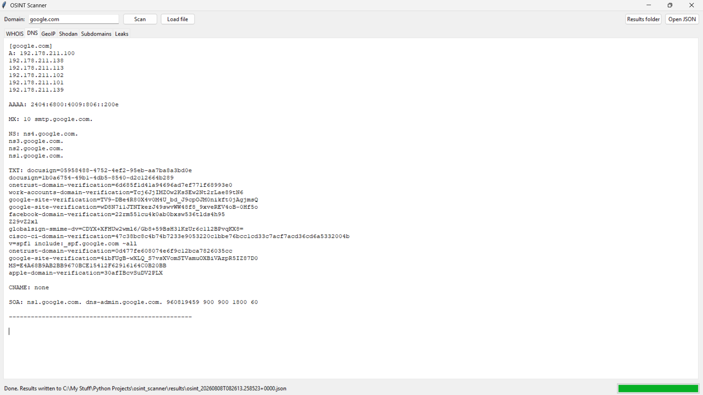
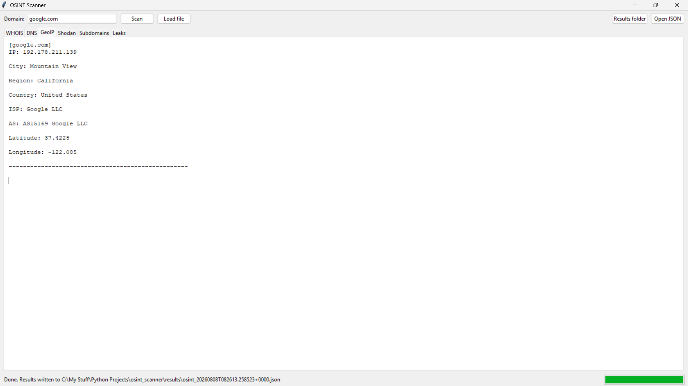
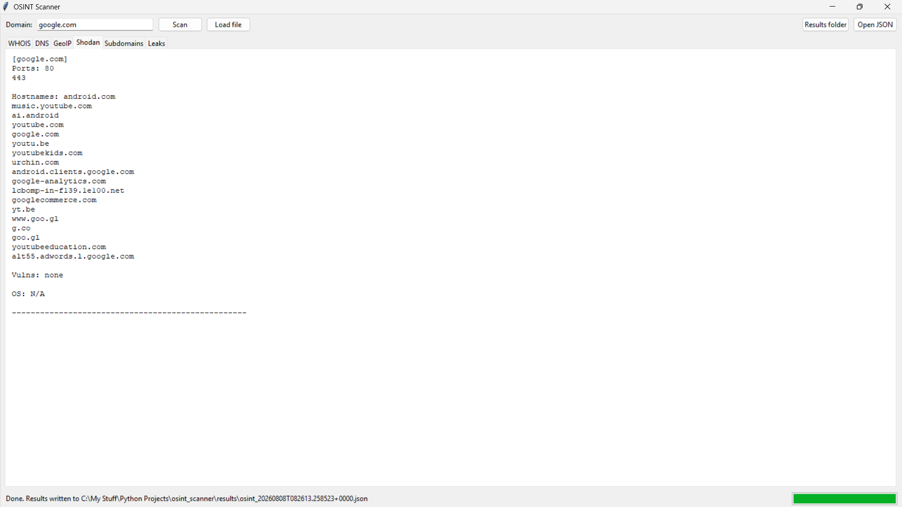
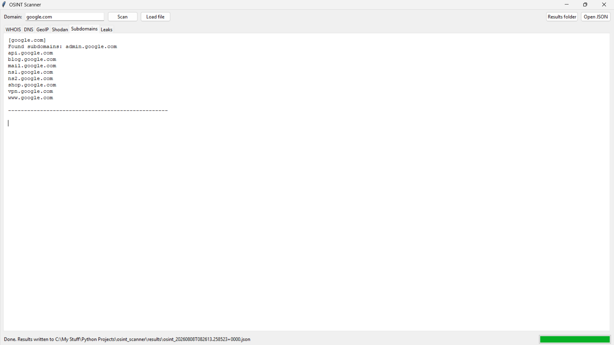
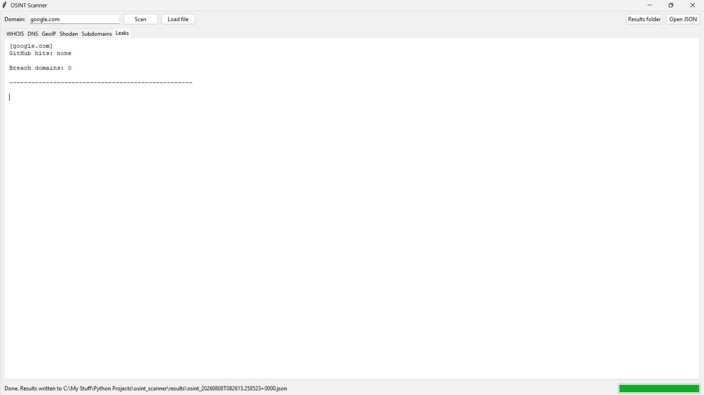

<div align="center">

# 🕵️‍♂️ OSINT-Scanner

**Advanced Open-Source Intelligence & Reconnaissance Engine**

[](https://www.python.org/)
[](https://opensource.org/licenses/MIT)
[]()
[]()

> A modern, modular, and deeply integrated reconnaissance tool designed for automated digital footprint analysis and threat intelligence.

<br />

[**Explore The Modules**](#-modules--capabilities) • [**Installation**](#-getting-started) • [**Usage Guide**](#-usage) • [**Report a Bug**](../../issues)

</div>

---

## 📖 Table of Contents
- [About the Project](#-about-the-project)
- [Interface Gallery](#-interface-gallery)
- [Key Features](#-key-features)
- [Modules & Capabilities](#-modules--capabilities)
- [Getting Started](#-getting-started)
- [Usage](#-usage)
- [Project Architecture](#-project-architecture)
- [Disclaimer](#-disclaimer)

---

## 🌟 About the Project

**OSINT-Scanner** streamlines complex reconnaissance workflows. Whether conducting security audits, tracking digital footprints, or gathering threat intelligence, this engine delivers comprehensive data collection entirely from public data sources—ensuring zero direct contact with the target. 

It provides two distinct ways to work:
1. **The GUI:** A sleek, interactive Tkinter dashboard for visual analysis.
2. **The CLI:** A lightning-fast, Rich-formatted terminal interface perfect for headless servers and bash scripting.

---

## 📸 Interface Gallery

*Experience a clean, responsive layout divided into specialized intelligence tabs.*

<table align="center">
  <tr>
    <td align="center"><b>Main Dashboard</b><br></td>
    <td align="center"><b>WHOIS & DNS Analysis</b><br></td>
  </tr>
  <tr>
    <td align="center"><b>GeoIP Tracking</b><br></td>
    <td align="center"><b>Shodan Reconnaissance</b><br></td>
  </tr>
  <tr>
    <td align="center"><b>Subdomain Enumeration</b><br></td>
    <td align="center"><b>Data Leaks & Export</b><br></td>
  </tr>
</table>

---

## 🚀 Key Features

*   ⚡ **Asynchronous & Rate-Limited:** Optimized data processing that respects free-tier API limits with configurable delays.
*   💻 **Dual Interface:** Choose your weapon. Operate visually via the desktop dashboard or automate tasks via the CLI.
*   📂 **Batch Processing:** Feed a `.txt` file of domains directly into the engine for mass reconnaissance.
*   📊 **Automated JSON Export:** Scan results are instantaneously saved to structured `JSON` reports for easy parsing or pipeline integration.
*   🛡️ **Resilient Architecture:** Built to fail gracefully. If a module hits an API limit or drops connection, the engine logs the error and proceeds without crashing.

---

## 🧩 Modules & Capabilities

| Module | Icon | Target Data | Description |
| :--- | :---: | :--- | :--- |
| **WHOIS** | 🌐 | *Domain Info* | Extracts registrar details, creation dates, and expiration schedules. |
| **DNS** | 🖧 | *Nameservers* | Maps and resolves standard record types (`A`, `AAAA`, `MX`, `NS`, `TXT`, `SOA`). |
| **GeoIP** | 📍 | *Location Map* | Resolves server coordinates, Autonomous System Numbers (ASN), and ISPs. |
| **Shodan** | 🔍 | *IoT Search* | Identifies open ports, running services, and known vulnerabilities *(Requires API Key)*. |
| **Subdomains** | 🌳 | *Asset Discovery* | Maps the attack surface via passive transparency logs and DNS brute-forcing. |
| **Leaks** | 🚨 | *Threat Intel* | Cross-references domains against known data breaches and GitHub code exposures. |

---

## 📦 Getting Started

### Prerequisites
Ensure you have **Python 3.10+** installed on your system.
*(Linux users: Ensure `python3-tk` is installed for GUI support).*

### Installation

1. **Clone the repository**
   ```bash
   git clone [https://github.com/https://github.com/Creator-Naren/OSINT-Scanner.git](https://github.com/https://github.com/Creator-Naren/OSINT-Scanner.git)
   cd OSINT-Scanner
